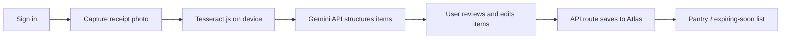

# EZXpire tech stack and file plan

## Locked decisions (v1)

- **OCR:** on-device via **Tesseract.js** (receipt image never leaves the browser for OCR)
- **AI assist:** **Gemini API only** (no ElevenLabs) — clean OCR text into structured line items and suggest categories/expiry (server-side only; key in `.env`)
- **Storage:** **MongoDB Atlas** (cloud pantry per user; sync across devices) — env keys added when auth/DB are wired
- **Accounts:** **Auth.js (NextAuth)** with a MongoDB adapter — env keys added when auth/DB are wired
- **Hosting:** **Vercel** (HTTPS for camera); Devpost links to the demo + GitHub only
- **ElevenLabs:** not in v1

## Env / secrets

Local secrets live in `[.env](.env)` (never committed). A committed `[.env.example](.env.example)` lists required keys without values. `[.gitignore](.gitignore)` ignores `.env`.

**Current `.env` (Gemini only for now):**

```env
# Google Gemini (server-side only — used from Next.js API routes)
GEMINI_API_KEY=
```

`MONGODB_URI` / `AUTH_SECRET` will be added later when accounts and Atlas are implemented. `GEMINI_API_KEY` is read only on the server — do not use a `NEXT_PUBLIC_` prefix.

## Tech stack


| Layer        | Choice                                             | Why                                                   |
| ------------ | -------------------------------------------------- | ----------------------------------------------------- |
| Framework    | **Next.js (App Router) + TypeScript**              | Mobile-friendly React, API routes, easy Vercel deploy |
| UI           | **Tailwind CSS**                                   | Fast mobile layout without a heavy component library  |
| OCR          | **Tesseract.js**                                   | Runs in the browser; free                             |
| AI           | **Gemini API**                                     | Structure OCR text + suggest expiry; key via `.env`   |
| Auth         | **Auth.js (NextAuth) + MongoDB adapter**           | Accounts/sessions; works with Atlas                   |
| Database     | **MongoDB Atlas**                                  | Hosted document DB for users + pantry items           |
| DB client    | **official `mongodb` driver**                      | Simple CRUD from API routes                           |
| Expiry logic | **Gemini suggestions + static heuristic fallback** | AI when available; table if Gemini fails              |
| Camera       | Browser `**getUserMedia` / file input**            | Works on phone over HTTPS                             |
| Deploy       | **Vercel**                                         | Set the same env vars in the Vercel project settings  |


## App flow




## Files to create (and purpose)

Scaffold / config:

- `[package.json](package.json)` — dependencies and scripts
- `[tsconfig.json](tsconfig.json)` — TypeScript config
- `[next.config.ts](next.config.ts)` — Next.js config
- `[postcss.config.mjs](postcss.config.mjs)` / `[tailwind.config.ts](tailwind.config.ts)` — Tailwind
- `[.gitignore](.gitignore)` — ignore `node_modules`, `.next`, `.env`, `.env*.local`
- `[.env.example](.env.example)` — documented keys without secrets
- `[.env](.env)` — local secrets including `GEMINI_API_KEY` (gitignored)
- Update `[README.md](README.md)` — stack, env setup, Atlas, Gemini, Vercel

App routes:

- `[app/layout.tsx](app/layout.tsx)` — root layout, session provider
- `[app/page.tsx](app/page.tsx)` — pantry home (auth-gated)
- `[app/scan/page.tsx](app/scan/page.tsx)` — scan → OCR → Gemini → review → save
- `[app/login/page.tsx](app/login/page.tsx)` — sign-in UI
- `[app/globals.css](app/globals.css)` — global styles
- `[app/api/auth/[...nextauth]/route.ts](app/api/auth/[...nextauth]/route.ts)` — Auth.js
- `[app/api/parse-receipt/route.ts](app/api/parse-receipt/route.ts)` — accepts OCR text; calls Gemini; returns structured items
- `[app/api/pantry/route.ts](app/api/pantry/route.ts)` — list / create pantry items
- `[app/api/pantry/[id]/route.ts](app/api/pantry/[id]/route.ts)` — update / delete item

Components, lib, data: as before, plus `[lib/gemini.ts](lib/gemini.ts)` (server helper using `GEMINI_API_KEY`).

## Implementation order (when you approve building)

1. Create `.gitignore`, `.env.example`, and local `.env` (Gemini key placeholder)
2. Scaffold Next.js + Tailwind; wire env vars
3. Auth.js + MongoDB Atlas; login; protect routes
4. Pantry API + list UI
5. Tesseract OCR → Gemini parse API → review/edit → save
6. Deploy to Vercel (add env vars there); polish mobile UX

No project files will be written until you leave plan mode / ask to implement (or approve creating `.env` in agent mode).