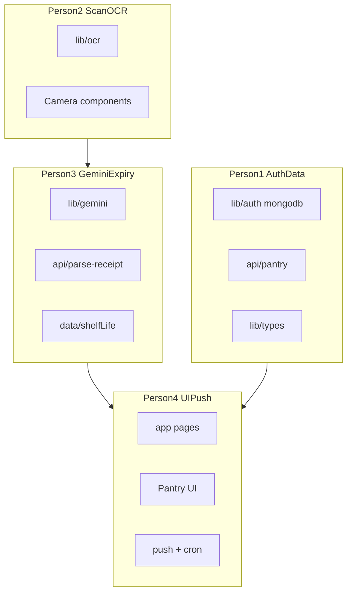

# Team file ownership (4 people)

**Rule:** only edit files in your lane. Shared contracts live in one file owned by Person 1; others import types, do not rewrite them. One person scaffolds the Next.js app first (`package.json`, Tailwind, etc.), then those config files are **frozen** unless agreed.

---

## Person 1 — Auth and pantry data

**Owns exclusively**

- `lib/types.ts` — shared `PantryItem`, `ParsedLine` (others only import)
- `lib/auth.ts`
- `lib/mongodb.ts`
- `app/api/auth/[...nextauth]/route.ts`
- `app/api/pantry/route.ts`
- `app/api/pantry/[id]/route.ts`
- `app/login/page.tsx`
- `components/AuthButtons.tsx`

**Does not touch:** OCR, Gemini, pantry list UI, push/cron

---

## Person 2 — Camera and on-device OCR

**Owns exclusively**

- `lib/ocr.ts`
- `components/CameraCapture.tsx`
- `components/ReceiptPreview.tsx`
- `components/OcrProgress.tsx`

**Integration note:** exports something like `runOcr(image) => string`. Does **not** own `app/scan/page.tsx` (Person 4 wires the page).

---

## Person 3 — Gemini and expiry heuristics

**Owns exclusively**

- `lib/gemini.ts`
- `lib/expiry.ts` — thin wrapper / fallback helpers if needed
- `data/shelfLife.ts`
- `app/api/parse-receipt/route.ts`
- `components/ParsedItemsEditor.tsx` — editable list UI for Gemini output (self-contained)

**Does not touch:** Tesseract, Mongo pantry routes, push

---

## Person 4 — App shell, pantry UI, notifications, deploy

**Owns exclusively**

- `app/layout.tsx`, `app/globals.css`
- `app/page.tsx` — pantry home; imports Person 1 APIs + own list components
- `app/scan/page.tsx` — **only** composes Person 2 + 3 components (thin glue)
- `components/PantryList.tsx`, `components/ItemRow.tsx`, `components/ExpiryBadge.tsx`
- `components/EnableNotifications.tsx`
- `lib/push.ts`
- `public/sw.js`
- `app/api/push/subscribe/route.ts`
- `app/api/cron/expiry-reminders/route.ts`
- `vercel.json`
- Vercel deploy / env in dashboard

**Does not rewrite:** `lib/ocr.ts`, `lib/gemini.ts`, pantry API route bodies

---

## Shared / freeze after scaffold (avoid conflicts)

Pick **one** person (recommend Person 4) to create once, then freeze:

- `package.json`, `tsconfig.json`, `next.config.ts`, `postcss.config.mjs`, `tailwind.config.ts`
- `.gitignore`, `.env.example` (others add keys via PR comment or Person 4 updates)

| Concern | Owner for edits |
| --- | --- |
| New npm dependency | Person who needs it opens PR; Person 4 merges `package.json` if contested |
| New shared type | Person 1 only in `lib/types.ts` |
| `.env` local secrets | each person locally; never commit |

---

## Conflict hotspots to avoid

- Do **not** all edit `app/scan/page.tsx` — only Person 4; P2/P3 ship components
- Do **not** put Gemini logic inside `lib/ocr.ts` or OCR inside `lib/gemini.ts`
- Cron may **read** pantry collection via `lib/mongodb.ts` (Person 1) but lives in Person 4’s cron route; if Person 1 needs a helper, add `lib/pantryQueries.ts` under Person 1 instead of editing the cron file

---

## Suggested branch naming

- `p1/auth-pantry-api`
- `p2/camera-ocr`
- `p3/gemini-parse`
- `p4/ui-push-deploy`
